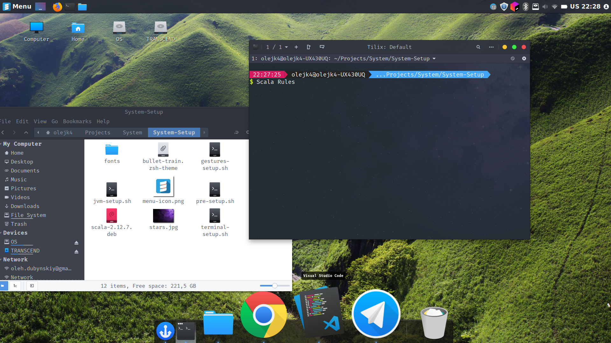

# System Setup

**Attention**
 This is my system setup which you may like or not, its main purpose is to make my system reinstall faster and easier, so this repo purpose is mainly for my needs. But feel free to explore and use it for your needs.

There are two strategies run `pre-install.sh` logout and login and then run `install.sh` for full setup or you could only run needed scripts.

## Scripts
* `jvm-setup.sh` - this script installs all my needed jvm software
* `ui-setup.sh` - this script installs themes, icons and Docky for UI enhancement
* `gestures-setup.sh` - this script installs all needed for gestures support with my prefered config and client to change it
* `terminal-setup.sh` - this script installs zsh, oh-my-zsh, tilix and powerlevel9k
 
## Fonts
In repository you can find my prefered fonts: SourceCodePro, FiraCode, RobotoMono. All fonts are Nerd Font patched so they are fully compatible with powerline. 

## Software
Postman, Lightshot, Atom, Sublime Text, Visual Code, Spacemacs, Idea, sbt, Scala, Tilix, Jetbrains Toolbox, Discord, Nautilus, zsh, oh-my-zsh, Konsole

## Images
There are `menu-icon.png` that i use as icon in panel and also there are `stars.jpg` photo that i use as my background in terminal and `profile.png` that is used as profile pic.

## UI
After running `ui-setup.sh` script you will get Numix, OSX-One and la-capitaine **icon themes**, breeze **cursor theme**, docky **dock**, Arc, X-Arc and McOs themes. Also you can install some of the fonts in repo or get another nerd font that is compatible with powerline.

## Gestures
After running `getures-setup.sh` script you will get fully working UI client for changing gesture config - `gestures` and default gesture config for 3 fingers moves:
* right - terminal
* left - files
* up - close app
* down - show all windows

## Terminal
After running `terminal-setup.sh` script you will have zsh, oh-my-zsh, tilix, terminal autosuggestions plugin and nice powerline theme. 
There is `.zshrc` that contains example zsh config that enable all installed in `terminal-setup.sh` script.

## JVM
After running `jvm-setup.sh` script you will have jdk-8, jre-8, sbt and scala